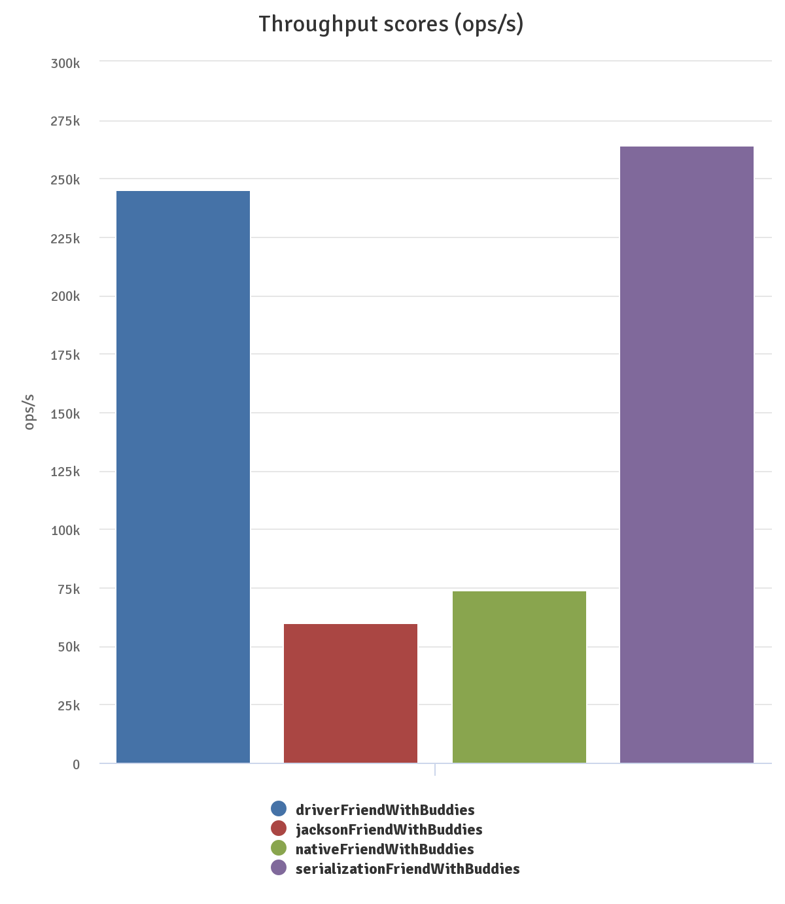
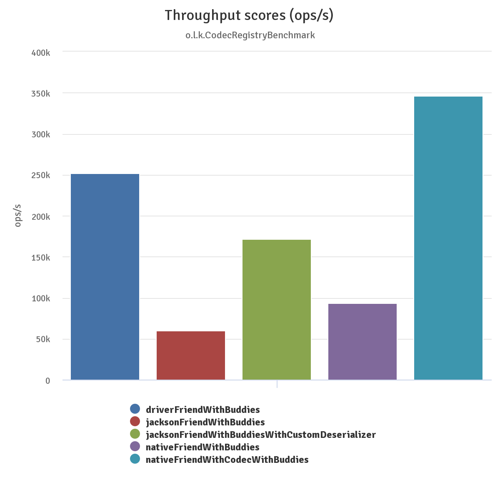
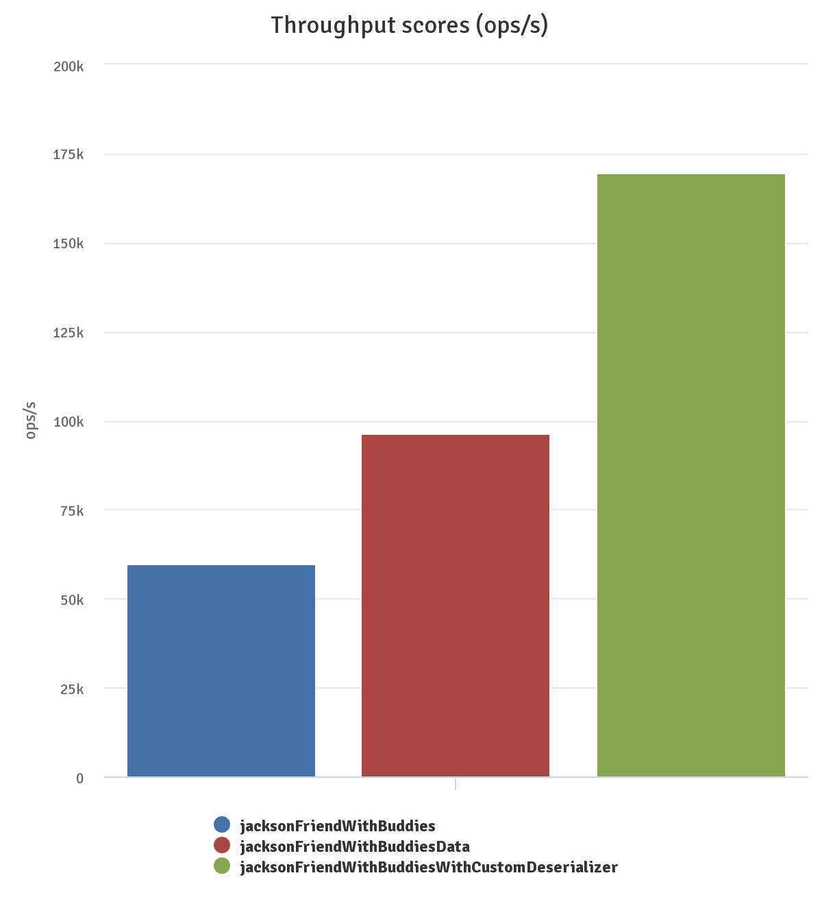
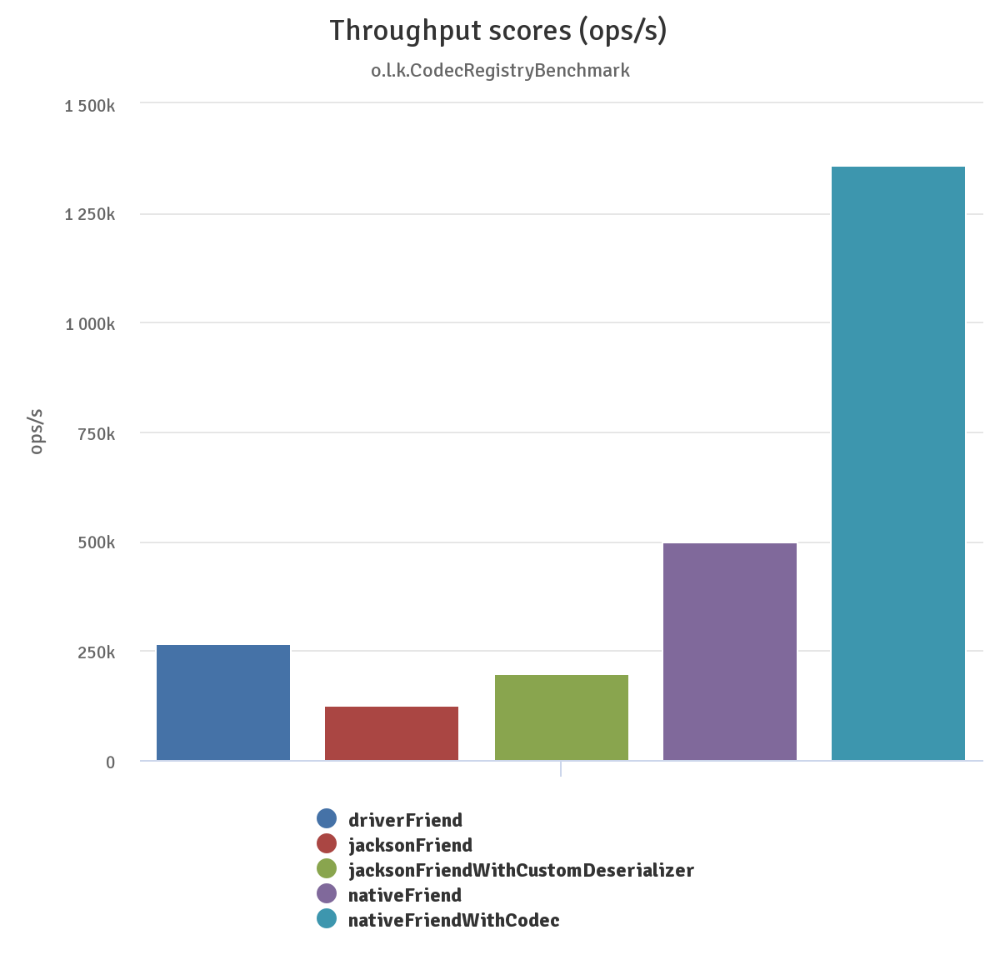

# Object Mapping Performance

Bson deserialization is a key factor to measure performance of KMongo,
as usually you retrieve more data from MongoDB than you send to the db.

## Complete deserialization

The benchmark sources are available in [github](https://github.com/Litote/kmongo/tree/master/kmongo-benchmark).

We take a Bson representation of this class: 

```kotlin
data class FriendWithBuddies(
     @BsonId
     val id: ObjectId? = null,
     val name: String? = null,
     val address: String? = null,
     val coordinate: Coordinate? = null,
     val gender: Gender? = null,
     val buddies: List<FriendWithBuddies> = emptyList()
 )
```

And deserialize it using:

- org.bson.Document (driverFriend)
- Jackson mapping (jacksonFriend)
- Native/POJO mapping (nativeFriend)

Measuring with [jmh](https://openjdk.java.net/projects/code-tools/jmh/):



As you can see, the org.bson.Document mapping (basically a Map) outperforms Jackson & Native mapping.

Note: during this benchmark, we have found a [~15% perf improvement](https://github.com/michel-kraemer/bson4jackson/pull/81)
for jackson but the fix is not included in the last released version of bson4jackson. However, even with this improvement,
the ranking stays the same.

Is it possible to improve Jackson & native mapping performance? Of course! You can write a custom Jackson deserializer
or a custom codec for the `FriendWithBuddies` class. Then you avoid reflection in both case, and you speed up your deserialization.

Then we get these results:



We can see that jackson is better now, but it is "Native" mapping that really shines.
However, writing a custom deserializer or codec is cumbersome and error prone. For Jackson, there is a [small library](https://github.com/Litote/kjackson/tree/master/jackson-generator)
that generates automatically the deserializers for the class annotated with @JacksonData. Here is the result:



The custom deserializer version performs better, but you get a 40% improvement "for free" with `@JacksonData`.

## Partial deserialization

Now we take the same Bson than before, but we deserialize it in a *partial* object: a friend without its buddies.

```kotlin
data class Friend(
     @BsonId
     val id: ObjectId? = null,
     val name: String? = null,
     val address: String? = null,
     val coordinate: Coordinate? = null,
     val gender: Gender? = null
 )
``` 

Here are the results:



Native mapping, even without custom codec, outperforms everything. This is because native mapping **skip** the not mapped bson data,
 when `org.bson.Document` & `Bson4Jackson` parse the bson entirely.

## Conclusion

If performance is critical for your use case, use "native" mapping and write custom Codecs for the most used parts of your project.
But Jackson does not perform that bad, and is also a valid choice for almost all projects.
 


    